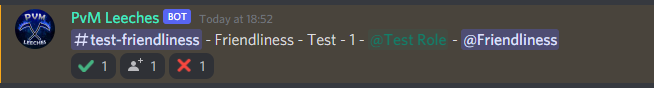

# Ticketing System
This page will explain how to use our ticketing system as a seller. Remember: if you have any questions, feel free to tag Support or Moderators.

## Overview
When the customer creates a ticket and selects a service, a message will appear in the appropriate channel. For example: `#mainscape-orders`, `#ironman-orders` or `#skiller-orders`.

The order will follow this format:

The first part is the ticket channel, in this case: `#test-friendliness`.
The second part is the customer's RSN, in this case: `Friendliness`.
The third part is the service they require, in this case: `Test`.
The fourth part is the amount of kills / tokens / ... they required, in this case: `1`.
The final part is the role you require to join said ticket, in this case: `@Test`.

__Note__: If a ticket has no fixed amount of kills, tokens, etc. it will say `#`.

As you can see there are also 3 buttons available on every order.

 allows you to join the ticket if you have the required role.

 marks the order as completed.

 deletes the order - mainly used when a customer cancels their order or when the amount .

## Step By Step
- If you spot an order you're interested in, click the 
 button to join it.
- Now you're able to talk with the customer to discuss a suitable time for you both.
- Form your team in `#sellers` or `#skilling-sellers`

Once the service is completed, click the  button to mark the order as completed.

__Note__: If the service listed `#` as amount, it's important to not hit ! The reason for this is that this is an undefined amount of kills, which would then be added to our spreadsheet.

Instead, you would hit  to remove the order and then head to `#add-to-completed` and manually send in the service you completed along with the exact amount you sold.

