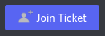
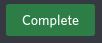
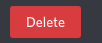

# Information
This page will explain how to use our ticketing system as a seller. Remember: if you have any questions, feel free to tag Support or Moderators.

# Table of Contents
- [Overview](#overview)
- [Step by Step](#step-by-step)
- [TL;DR](#tldr)

# Overview
When the customer creates a ticket and selects a service, a message will appear in the appropriate channel. For example: `#mainscape-orders`, `#ironman-orders` or `#skiller-orders`.

The order will follow this format:

- **1st part** the ticket channel, in this case: `#vindy-loot-blurred`.
- **2nd part** is the service they require, in this case: `Vindicta 100% Loot`.
- **3rd part** is the amount of kills / tokens / ... they require, in this case: `#`, meaning the amount is unspecified.

__Note__: If a ticket has no specified amount of kills, tokens, etc. it will say `#`.

As you can see there are also 3 buttons available on every order.

 allows you to join the ticket if you have the required role.
This button also allows you to leave the ticket if you've already joined it.

 marks the order as completed.

 deletes the order - mainly used when a customer cancels their order or when you've added their kills by using the `/addtocomp` command or through the `#add-to-completed` channel.

# Step By Step
- If you spot an order you're interested in, click the 
 button to join it.
- Now you're able to talk with the customer to discuss a suitable time for you both.
- Form your team in `#sale-pings`, `#skilling-sellers`, etc.

Once the service is completed, click the  button to mark the order as completed.

__Note__: 
- If the service listed `#` as amount, you will be asked how many kills you sold to the user and whether you would like to keep the order open or not.
- If you sold a different amount than the amount listed, you should preferably use the `/addtocomp` command inside of the customer's ticket or alternatively the`#add-to-completed` channel instead. If the order is then finished, delete it by pressing .

# TL;DR
- Check the appropriate channel for an order (`#mainscape-orders`, `#ironman-orders` or `#skilling-orders`)
- Join the ticket by clicking 
- Sell the service
- If the amount of services is correct or is `#`, hit 
- If the amount is not correct and is not `#`, hit  and use the `/addtocomp` command inside of the customer's ticket or post in `#add-to-completed` channel.
